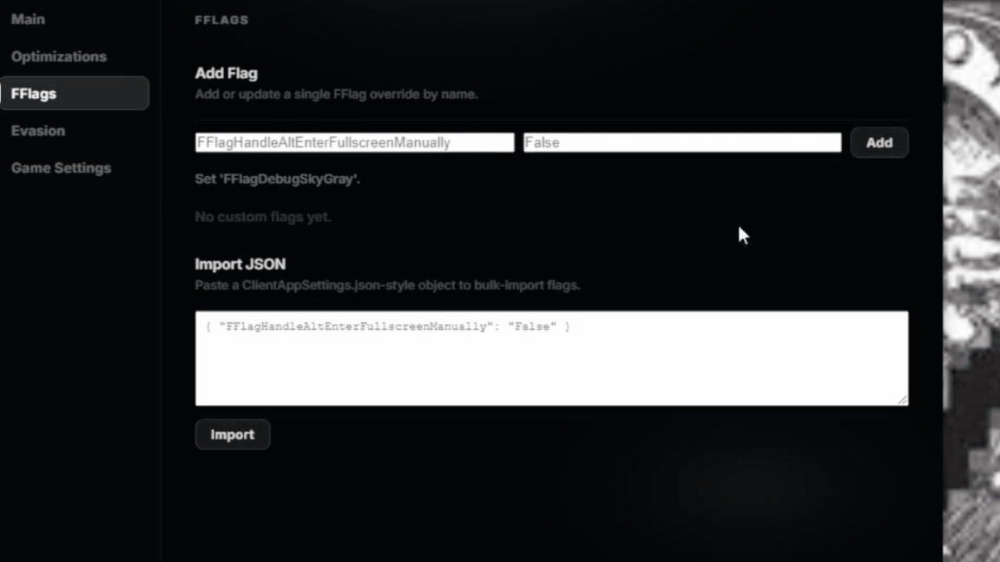

 
 

<h1 align="center">© 2026 Sai. All rights reserved.</h1> 

> [!CAUTION]
> This project is currently in beta and is very new.
> It is only intended to run on Windows.
> This project **is not a Roblox hack!**

> [!NOTE]
> All contributions are fully welcome. If you have any new samples,
> please open a pull request with the new sample if you are interested.

> [!TIP]
> If you need help, refer to the [Support Server](https://discord.gg/xhZee9ZkZz).
> Python is required if you plan to compile it yourself.

---

**THIS README IS NOT THE DOCUMENTATION**

# Introduction

Welcome to the official repository of JelloClient.

Throughout this README, you'll find an explanation of what JelloClient is and how it works.
The full documentation is currently a work in progress.

## What is JelloClient?

JelloClient is a Roblox Bootstrapper that makes it much easier for you to manage things such as:

- FFlags
- Modifications (compliant with Roblox TOS — no memory editing or offsets)
- Optimizations

---

# FAQ

## How does JelloClient work?

JelloClient uses variables that Roblox exposes through their TOS and influences them accordingly.

## How do FFlags work?

FFlags are a feature that **Roblox themselves implemented.** They allow you to toggle developer-facing options that can provide advantages and performance optimizations. You can apply FFlags using our JSON Importer or our manual Importer.

## How do I install it?

The project is currently in beta. While it is open source, an official install protocol does not exist **yet** — but it is actively being worked on and updates will come regularly.

*Refer to the Releases page in the meantime.*